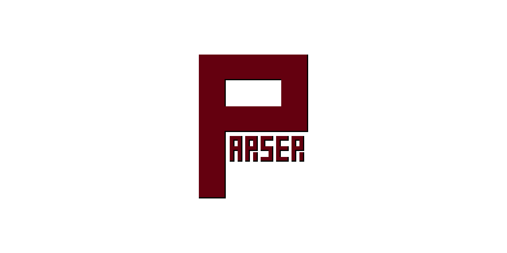

  

  
  
  
  
  
  

# **Parser Library**

`parser` is a **lightweight C++23 library** for building **recursive-descent parsers**. It works seamlessly with the
**[`lexer`](https://github.com/nnidhogg/lexer)** project and provides a **token stream with lookahead**, **source
tracking**, and **error reporting**. The design focuses on **clarity**, **deterministic control flow**, and a small,
predictable API, making it easy to implement **LL(1)-style grammars** for DSLs, configuration formats, or full language
front-ends.

## **Status: Work in Progress**

This parsing library is actively developed and not yet feature-complete. The core components: **token streaming**,
**lookahead**, **source location tracking**, and **structured error reporting** are stable, but higher-level
abstractions are still evolving.

As an initial application of the library, work is underway to build an **AST and parser for an Interface Definition
Language (IDL)**. This will serve as both a **reference implementation** and a **validation** of the library’s design
and usability.

Breaking changes may occur while the API is being refined.

## **License**

This project is licensed under the terms of the MIT License. See the [LICENSE](LICENSE) file for details.

## **Author**

Developed and maintained by **Nicklas Nidhögg**  
GitHub: [nnidhogg](https://github.com/nnidhogg)
